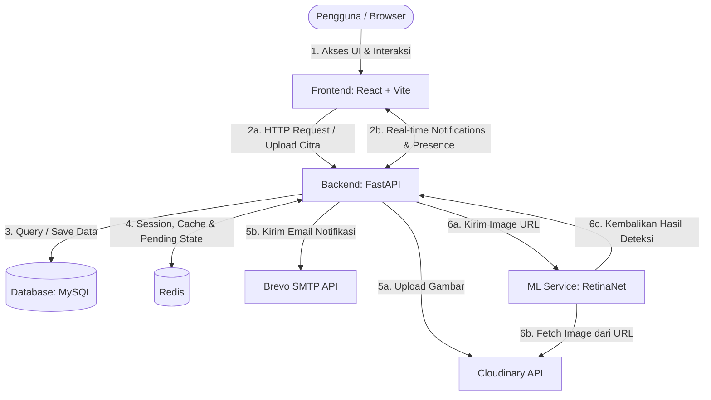

# NyawitAI - Precision Agronomy & Plantation Intelligence Platform 🌴

NyawitAI adalah platform intelijen perkebunan kelapa sawit berbasis web yang menyediakan analisis kesehatan pohon secara otomatis menggunakan citra UAV (Unmanned Aerial Vehicle) / Drone. Platform ini memadukan model Machine Learning RetinaNet untuk deteksi objek dengan analisis spasial untuk menghasilkan rekomendasi perawatan dan pemupukan yang presisi (Variable Rate Application - VRA).

---

## 📐 Arsitektur Sistem

Sistem NyawitAI terdiri dari tiga komponen utama yang saling berinteraksi:
1.  **Frontend (React + Vite + TypeScript)**: Antarmuka pengguna untuk interaksi peta spasial, dashboard statistik, pengelolaan blok, laporan, dan visualisasi hasil deteksi pohon.
2.  **Backend (FastAPI + MySQL + Redis)**: Menyediakan API RESTful, autentikasi JWT, WebSocket untuk notifikasi real-time, manajemen database, dan integrasi penyimpanan cloud (Cloudinary) serta pengiriman email.
3.  **Machine Learning Service (RetinaNet)**: Layanan backend khusus kecerdasan buatan berbasis Python yang memuat model RetinaNet untuk mendeteksi pohon sawit sehat/sakit/mati dari citra udara.




---

## 1. 🛠️ Cara Instalasi

### 1. Prasyarat Sistem (Prerequisites)
Sebelum memulai instalasi, pastikan software berikut sudah terinstal di komputer Anda:
*   **Python 3.10 atau 3.11** (Direkomendasikan untuk stabilitas library ML)
*   **Node.js (v18+)** & **npm**
*   **MySQL Server** (Port default: `3306`)
*   **Redis Server** (Port default: `6379`)
*   **Git**
*   **uv** (Fast Python Package Manager — instal via `pip install uv`)

---

### 2. Langkah Instalasi (Localhost)

#### 1. Kloning Repositori Utama (Backend & Frontend)
```bash
git clone https://github.com/capstone-nyawit/capstone-pijak-analisis-sawit.git
cd capstone-pijak-analisis-sawit
```

#### 2. Instalasi Backend (FastAPI)
1.  **Sinkronisasi Dependensi Menggunakan `uv`:**
    ```bash
    # Membuat virtual environment dan menginstal dependensi otomatis
    uv sync
    ```
2.  **Konfigurasi Environment Variables (`.env`):**
    Salin file `.env.example` menjadi `.env`:
    ```bash
    cp .env.example .env
    ```
    Buka file `.env` dan sesuaikan kredensial MySQL, Redis, Cloudinary, dan Brevo SMTP lokal Anda.

#### 3. Instalasi Frontend (React + Vite)
1.  **Masuk ke Folder Frontend & Instal NPM Packages:**
    ```bash
    cd frontend
    npm install
    ```
2.  **Konfigurasi Environment Variables (`.env`):**
    Salin file `.env.example` menjadi `.env` di folder `frontend`:
    ```bash
    cp .env.example .env
    ```
    Pastikan `VITE_API_URL` mengarah ke backend lokal Anda:
    ```env
    VITE_API_URL=http://localhost:8000/api
    ```


---

## 2. ⚡ Cara Menjalankan Sistem

Pastikan layanan **MySQL** dan **Redis** lokal Anda sudah aktif sebelum menjalankan sistem.

### 1. Menjalankan Backend (FastAPI)
1.  Aktifkan virtual environment backend.
2.  Jalankan migrasi database (jika database masih kosong):
    ```bash
    alembic upgrade head
    ```
3.  Jalankan aplikasi backend:
    ```bash
    # Menggunakan script main.py proyek
    python main.py
    ```
    *Backend lokal berjalan di `http://localhost:8000`.*

### 2. Menjalankan Frontend (React + Vite)
```bash
cd frontend
npm run dev
```
*Frontend lokal berjalan di `http://localhost:5173`.*


---

## 3. 📂 Struktur Proyek

Berikut adalah struktur folder utama dari repositori proyek NyawitAI:

```text
capstone-pijak-analisis-sawit/
├── alembic/                # Konfigurasi & file migrasi database MySQL
├── app/                    # Kode utama Backend FastAPI
│   ├── api/                # Endpoint & rute API (auth, logs, users, dll)
│   ├── core/               # Konfigurasi sistem (security, db, config)
│   ├── models/             # Schema tabel SQLAlchemy (user, log, dll)
│   ├── schemas/            # Validation schemas menggunakan Pydantic
│   └── services/           # Service internal (email, cloudinary, logic)
├── frontend/               # Kode aplikasi Frontend React + Vite
│   ├── public/             # File publik statis
│   └── src/                # Source code React (TSX)
│       ├── components/     # Komponen UI (dashboard user & admin, dll)
│       ├── pages/          # Halaman utama (Dashboard, AdminDashboard, Auth)
│       └── lib/            # Utilitas & setup (axios API client)
├── Dockerfile              # Docker configuration untuk backend
├── docker-compose.yml      # Orkestrasi container API backend & Redis
├── main.py                 # Script utama untuk menjalankan server backend
├── pyproject.toml          # Konfigurasi dependensi backend berbasis uv
└── requirements.txt        # Daftar dependensi format pip legacy
```

---

## 4. 📖 API Documentation

Backend FastAPI menyediakan dokumentasi API interaktif secara otomatis menggunakan Swagger UI dan ReDoc. 

Setelah server backend dijalankan secara lokal, dokumentasi API dapat diakses melalui browser pada URL berikut:

*   **Swagger UI (Interaktif & Uji Coba Endpoint)**: [http://localhost:8000/docs](http://localhost:8000/docs)
*   **ReDoc (Dokumentasi Statis & Terstruktur)**: [http://localhost:8000/redoc](http://localhost:8000/redoc)

### Kelompok Endpoint Utama:
1.  **`/auth`**: Autentikasi pengguna, registrasi (individual/organisasi), verifikasi email, kirim ulang tautan verifikasi, forgot password, dan reset password.
2.  **`/users`**: Manajemen profil, perubahan kata sandi, pergantian alamat email, serta persetujuan (*approval*) staf baru oleh admin.
3.  **`/logs`**: Riwayat sesi analisis citra drone perkebunan (membuat log baru, detail log, menghapus log, audit log admin).
4.  **`/reports`**: Download laporan hasil analisis dalam format PDF atau Excel.
5.  **`/vra`**: Pengambilan rekomendasi pemupukan dan tindakan agronomi presisi per blok lahan.
6.  **`/user-notifications`**: Manajemen notifikasi real-time WebSocket untuk aktivitas analisis selesai.

---

## 🧹 Script Bantuan
Jika Anda ingin mereset/mengosongkan seluruh isi database tabel dan cache Redis (untuk testing awal), Anda bisa menjalankan skrip berikut di root folder backend:
```bash
python clear_db.py
```
*(Akan muncul konfirmasi prompt keamanan sebelum database dihapus)*
