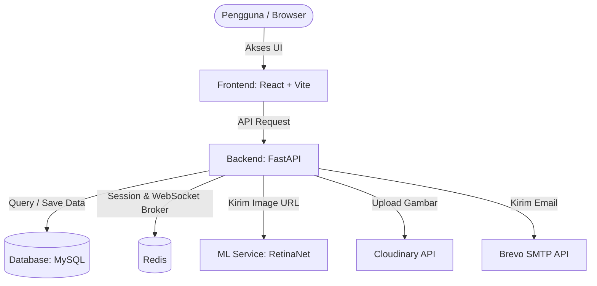

# NyawitAI - Precision Agronomy & Plantation Intelligence Platform 🌴

NyawitAI adalah platform intelijen perkebunan kelapa sawit berbasis web yang menyediakan analisis kesehatan pohon secara otomatis menggunakan citra UAV (Unmanned Aerial Vehicle) / Drone. Platform ini memadukan model Machine Learning RetinaNet untuk deteksi objek dengan analisis spasial untuk menghasilkan rekomendasi perawatan dan pemupukan yang presisi (Variable Rate Application - VRA).

Dokumen ini menjelaskan arsitektur sistem, langkah-langkah menjalankan proyek di lingkungan lokal (Localhost), serta panduan deployment lengkap untuk lingkungan produksi menggunakan VPS (Ubuntu Server) dan Netlify.

---

## 📐 Arsitektur Sistem

Sistem NyawitAI terdiri dari tiga komponen utama yang saling berinteraksi:
1.  **Frontend (React + Vite + TypeScript)**: Antarmuka pengguna untuk interaksi peta spasial, dashboard statistik, pengelolaan blok, laporan, dan visualisasi hasil deteksi pohon.
2.  **Backend (FastAPI + MySQL + Redis)**: Menyediakan API RESTful, autentikasi JWT, WebSocket untuk notifikasi real-time, manajemen database, dan integrasi penyimpanan cloud (Cloudinary) serta pengiriman email.
3.  **Machine Learning Service (RetinaNet)**: Layanan backend khusus kecerdasan buatan berbasis Python yang memuat model RetinaNet untuk mendeteksi pohon sawit sehat/sakit/mati dari citra udara.



---

## 🛠️ Persyaratan Sistem (Prerequisites)

Sebelum memulai replikasi, pastikan software berikut sudah terinstal di komputer Anda:
*   **Python 3.10 atau 3.11** (Direkomendasikan untuk stabilitas library ML)
*   **Node.js (v18+)** & **npm**
*   **MySQL Server** (Port default: `3306`)
*   **Redis Server** (Port default: `6379`)
*   **Git**

---

## 💻 Panduan Pengembangan Lokal (Localhost Development)

Unduh repositori proyek ke komputer lokal Anda:
```bash
git clone https://github.com/capstone-nyawit/capstone-pijak-analisis-sawit.git
cd capstone-pijak-analisis-sawit
```

### 1. Pengaturan Backend (FastAPI) Lokal
1.  **Buat Virtual Environment & Instal Dependensi:**
    ```bash
    python -m venv .venv
    
    # Aktifkan Virtual Environment
    # Di Windows:
    .venv\Scripts\activate
    # Di Linux/Mac:
    source .venv/bin/activate

    pip install -r requirements.txt
    ```
2.  **Konfigurasi Environment Variables (`.env`):**
    Salin file `.env.example` menjadi `.env` di folder root backend:
    ```bash
    cp .env.example .env
    ```
    Buka file `.env` dan isi kredensial database MySQL, Redis, Cloudinary, Brevo, dan SMTP lokal Anda.
3.  **Jalankan Migrasi Database:**
    Pastikan MySQL Anda aktif dan nama database telah dibuat sesuai konfigurasi `.env`.
    ```bash
    alembic upgrade head
    ```
4.  **Jalankan Server Backend:**
    ```bash
    uvicorn app.main:app --reload --port 8000
    ```
    *Backend local berjalan di `http://localhost:8000`.*

### 2. Pengaturan Frontend (React + Vite) Lokal
1.  **Masuk ke Folder Frontend & Instal Dependensi:**
    ```bash
    cd frontend
    npm install
    ```
2.  **Konfigurasi Environment Variables (`.env`):**
    Salin file `.env.example` menjadi `.env` di folder `frontend`:
    ```bash
    cp .env.example .env
    ```
    Buka file `.env` dan pastikan mengarah ke port backend lokal Anda:
    ```env
    VITE_API_URL=http://localhost:8000/api
    ```
3.  **Jalankan Server Frontend:**
    ```bash
    npm run dev
    ```
    *Frontend local berjalan di `http://localhost:5173`.*

### 3. Pengaturan Model (Machine Learning Service) Lokal
1.  Siapkan environment Python terpisah (Python 3.10) untuk menghindari konflik library.
2.  Instal dependensi inti untuk model ML (CPU Mode):
    ```bash
    pip install torch torchvision torchaudio --index-url https://download.pytorch.org/whl/cpu
    pip install "numpy<2" opencv-python-headless fastapi uvicorn pillow httpx
    ```
3.  Jalankan server ML local di port `8001`:
    ```bash
    uvicorn main:app --reload --port 8001
    ```
    *Layanan ML lokal berjalan di `http://localhost:8001`.*

---

## 🚀 Panduan Deployment Lengkap (Production Deployment)

Berikut adalah panduan lengkap untuk melakukan deployment sistem NyawitAI secara komprehensif pada **VPS (Ubuntu Server)** dan **Netlify**.

---

### Langkah 1: Inisialisasi & Pengaturan Awal VPS
Hubungkan ke VPS Anda melalui SSH:
```bash
ssh kudo@145.79.8.52
```

1.  **Update Package & Instal Dependensi:**
    ```bash
    sudo apt update && sudo apt upgrade -y
    sudo apt install git curl software-properties-common python3-pip python3-venv nginx -y
    ```
2.  **Instal Docker & Docker Compose:**
    ```bash
    curl -fsSL https://get.docker.com -o get-docker.sh
    sudo sh get-docker.sh
    sudo usermod -aG docker $USER
    newgrp docker
    sudo systemctl enable docker
    sudo systemctl start docker
    ```

---

### Langkah 2: Setup Layanan Machine Learning di VPS (Port 8001)
Layanan ML berjalan secara terpisah dan dimanage menggunakan `systemd` agar otomatis menyala saat server restart.

1.  **Persiapkan Direktori & Virtual Environment:**
    ```bash
    cd ~/nyawitaia-app/ml_service
    python3 -m venv venv_ml
    source venv_ml/bin/activate
    ```
2.  **Instal Dependensi Pendukung CPU:**
    ```bash
    pip install torch torchvision torchaudio --index-url https://download.pytorch.org/whl/cpu
    pip install "numpy<2" opencv-python-headless fastapi uvicorn pillow httpx
    ```
3.  **Buat File Service Systemd:**
    ```bash
    sudo nano /etc/systemd/system/nyawit-ml.service
    ```
    Masukkan konfigurasi berikut (sesuaikan path folder):
    ```ini
    [Unit]
    Description=NyawitAI ML Service (RetinaNet)
    After=network.target

    [Service]
    User=kudo
    WorkingDirectory=/home/kudo/nyawitaia-app/ml_service
    ExecStart=/home/kudo/nyawitaia-app/ml_service/venv_ml/bin/uvicorn main:app --host 127.0.0.1 --port 8001
    Restart=always

    [Install]
    WantedBy=multi-user.target
    ```
    Simpan file, lalu jalankan servicenya:
    ```bash
    sudo systemctl daemon-reload
    sudo systemctl enable nyawit-ml
    sudo systemctl start nyawit-ml
    ```

---

### Langkah 3: Setup Backend FastAPI (Docker Compose & Alembic)
1.  **Arahkan ke folder backend dan salin file environment:**
    ```bash
    cd ~/nyawitaia-app/backend
    cp .env.example .env
    nano .env
    ```
    *Sesuaikan nilai credential database MySQL, Redis, Cloudinary, dan Brevo Anda.*
2.  **Jalankan Migrasi Database di VPS:**
    ```bash
    python3 -m venv venv_be
    source venv_be/bin/activate
    pip install -r requirements.txt
    alembic upgrade head
    deactivate
    ```
3.  **Jalankan Container Backend:**
    ```bash
    docker-compose up -d --build
    ```
    *API Backend sekarang berjalan di Docker port `8050`.*

---

### Langkah 4: Nginx Reverse Proxy & SSL (Let's Encrypt)
Nginx bertindak sebagai penerima request luar dan mengarahkannya ke port backend `8050`.

1.  **Buat Konfigurasi Blok Server Nginx:**
    ```bash
    sudo nano /etc/nginx/sites-available/nyawit-api
    ```
    Isi dengan konfigurasi berikut (sesuaikan `api.nyawit.id` dengan subdomain Anda):
    ```nginx
    server {
        listen 80;
        server_name api.nyawit.id;

        # Backend FastAPI REST API
        location / {
            proxy_pass http://127.0.0.1:8050;
            proxy_set_header Host $host;
            proxy_set_header X-Real-IP $remote_addr;
            proxy_set_header X-Forwarded-For $proxy_add_x_forwarded_for;
            proxy_set_header X-Forwarded-Proto $scheme;
        }

        # WebSocket Support (PENTING untuk Notifikasi Real-time)
        location /api/ws/ {
            proxy_pass http://127.0.0.1:8050;
            proxy_http_version 1.1;
            proxy_set_header Upgrade $http_upgrade;
            proxy_set_header Connection "upgrade";
            proxy_set_header Host $host;
            proxy_set_header X-Real-IP $remote_addr;
            proxy_set_header X-Forwarded-For $proxy_add_x_forwarded_for;
        }
    }
    ```
2.  **Aktifkan Konfigurasi & Restart Nginx:**
    ```bash
    sudo ln -s /etc/nginx/sites-available/nyawit-api /etc/nginx/sites-enabled/
    sudo nginx -t
    sudo systemctl restart nginx
    ```
3.  **Instal SSL HTTPS (Certbot Let's Encrypt):**
    ```bash
    sudo apt install certbot python3-certbot-nginx -y
    sudo certbot --nginx -d api.nyawit.id
    ```

---

### Langkah 5: Deployment Frontend ke Netlify
1.  Pastikan repositori GitHub Anda memiliki file `frontend/public/_redirects` dengan konten:
    ```text
    /*    /index.html   200
    ```
2.  Buka dashboard **Netlify**, tambahkan situs baru dan hubungkan ke repositori GitHub proyek Anda.
3.  Konfigurasikan **Build settings** berikut:
    *   **Base directory**: `frontend`
    *   **Build command**: `npm run build`
    *   **Publish directory**: `frontend/dist`
4.  Buka tab **Site configuration** -> **Environment variables**, lalu tambahkan:
    *   `VITE_API_URL` dengan nilai URL API HTTPS VPS Anda (misalnya: `https://api.nyawit.id/api`).
5.  Klik **Deploy site**.

---

### Langkah 6: Pengamanan Firewall (UFW)
Untuk keamanan optimal, batasi port VPS luar agar hanya port HTTPS, HTTP, dan SSH yang dapat diakses dari publik:
```bash
sudo ufw default deny incoming
sudo ufw default allow outgoing
sudo ufw allow 22/tcp
sudo ufw allow 80/tcp
sudo ufw allow 443/tcp
sudo ufw enable
```

---

### Langkah 7: Pengujian & Validasi
1.  Buka alamat frontend Netlify di browser dan lakukan login/registrasi.
2.  Cobalah mengunggah gambar pohon kelapa sawit pada halaman analisis.
3.  Jika deteksi selesai dan koordinat ditampilkan di peta, seluruh alur sistem (Frontend $\leftrightarrow$ Backend $\leftrightarrow$ ML Service) telah berhasil dideploy secara sempurna!

---

## 🧹 Script Bantuan
Jika Anda ingin mereset/mengosongkan seluruh isi database tabel dan cache Redis (untuk testing awal), Anda bisa menjalankan skrip berikut di root folder backend:
```bash
.venv\Scripts\python clear_db.py
```
*(Akan muncul konfirmasi prompt keamanan sebelum database dihapus)*

---

## 📝 Catatan Penting
*   Pastikan Redis berjalan di latar belakang (port bawaan: `6379`), jika tidak, proses autentikasi dan WebSocket tidak akan berfungsi.
*   Jika Anda menjumpai masalah koneksi CORS, periksa konfigurasi `BACKEND_CORS_ORIGINS` di file `.env` backend Anda.

---
**Dikembangkan oleh Tim Capstone Nyawit 🌴**
